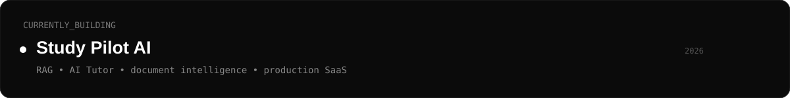
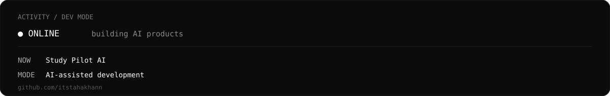

Taha Khan

  
 
 <strong>AI Developer • Full-Stack Developer • Automation Builder</strong> 
 
 I build practical software with AI, APIs, databases, and automation. 
 
   

// about

Hi, I'm Taha.

I'm a developer interested in AI, automation, APIs and full-stack development.

I like taking an idea and turning it into something people can actually use.

Currently focused on:
→ AI applications
→ RAG systems
→ AI automation
→ APIs & integrations
→ Full-stack web applications
→ Desktop applications
// currently building

  

// tech stack
Languages

      

Frameworks & Tools

       

AI & Backend

      

// projects
Study Pilot AI

AI-powered study assistant for learning from your own notes and documents.

Input → AI/RAG → Grounded answer → Sources

Upload notes, textbooks and documents
Document processing and text extraction
RAG-based question answering
AI tutor experience
Source-grounded responses
Supabase backend
AI API integration

Stack: React • JavaScript • Supabase • AI APIs • RAG
VaultX

Local-first password and credential manager concept.

Credentials → Encryption → Local Vault

Encrypted local storage
Credential organization
Password management
Vault-based architecture
Privacy-focused design

Stack: JavaScript • Web APIs • Encryption
// contribution graph

  

// github stats

 

 
  

// contribution snake

  

// activity

  

// connect

   
 
 Build → Ship → Learn → Repeat. 

