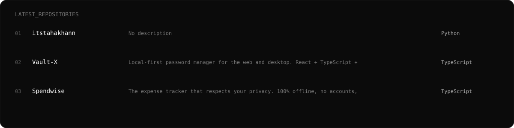

<div align="center">


<br>

<a href="https://github.com/itstahakhann">
  
</a>
<a href="https://github.com/itstahakhann?tab=repositories">
  
</a>

</div>

---

## `> whoami`

I'm **Taha Khan**, an AI-focused developer building practical software with AI APIs, automation, modern web technologies, and databases.

I like taking an idea from **concept → prototype → product**.

```text
AI          ████████████████████  building
Automation  █████████████████░░░  building
Full Stack  ██████████████████░░  shipping
RAG         ███████████████░░░░░  learning
Agents      ██████████████░░░░░░  experimenting
```

---

## `// currently building`


---

## `// stack`

<div align="center">


<br><br>

`AI APIs` · `RAG` · `Embeddings` · `Automation` · `REST APIs` · `Authentication` · `Databases`

</div>

---

## `// selected projects`

<table>
<tr>
<td width="50%">

### 🧠 Study Pilot AI

AI study assistant built around user-provided learning material.

**Pipeline**

`Upload → Extract → Chunk → Embed → Retrieve → Answer`

**Focus:** RAG · embeddings · AI APIs · Supabase

</td>
<td width="50%">

### 🏨 9eve

Hotel management software being redesigned as a desktop application.

**Pipeline**

`Guest → Reservation → Room → Billing → Management`

**Focus:** Electron · desktop UX · local workflows

</td>
</tr>

<tr>
<td width="50%">

### 🧾 Invoice Lite

Lightweight desktop invoicing application.

**Pipeline**

`Customer → Items → Invoice → Print / Save`

**Focus:** Electron · JavaScript · clean UI

</td>
<td width="50%">

### 💰 SpendWise

Expense-tracking product focused on simple personal finance workflows.

**Pipeline**

`Expense → Category → Database → Insights`

**Focus:** web app · auth · database

</td>
</tr>
</table>

---

## `// latest repositories`



---

## `// github trophies`

<div align="center">


</div>

---

## `// coding time`

<div align="center">

<!-- Replace YOUR_WAKATIME_EMBED_URL with your public WakaTime embeddable chart URL. -->
<a href="https://wakatime.com/">

</a>

</div>

> **Setup:** Create a public WakaTime embeddable chart and replace `YOUR_WAKATIME_EMBED_URL` above.

---

## `// activity`


---

## `// contribution snake`

<div align="center">


</div>

---

## `// stats`

<div align="center">


</div>

---

## `// contribution graph`


---

## `// connect`

<div align="center">

<a href="https://github.com/itstahakhann">

</a>
<a href="https://www.linkedin.com/">

</a>

<br><br>

**Build → Ship → Learn → Repeat.**

</div>
